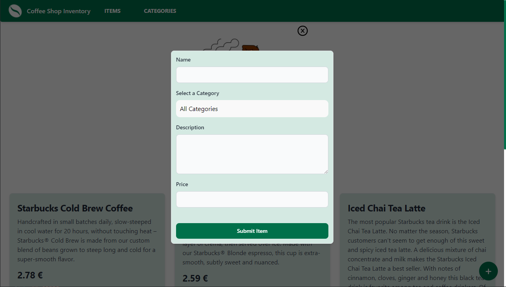
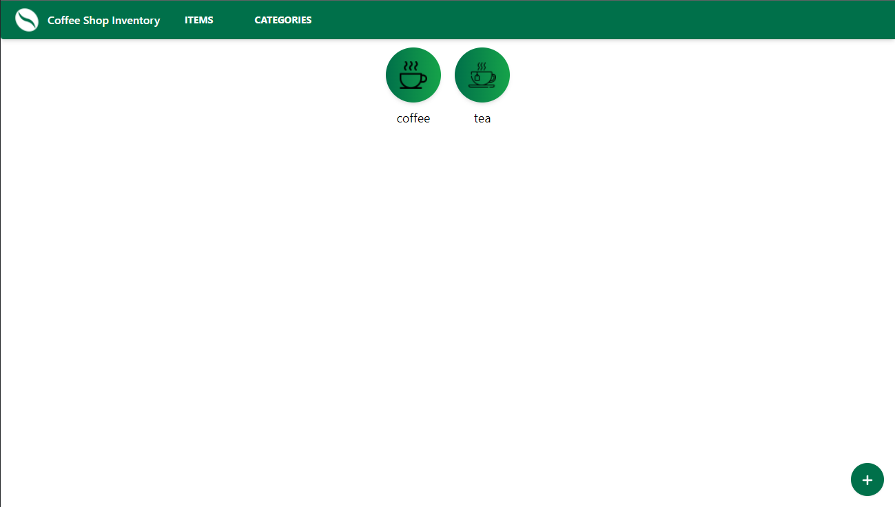
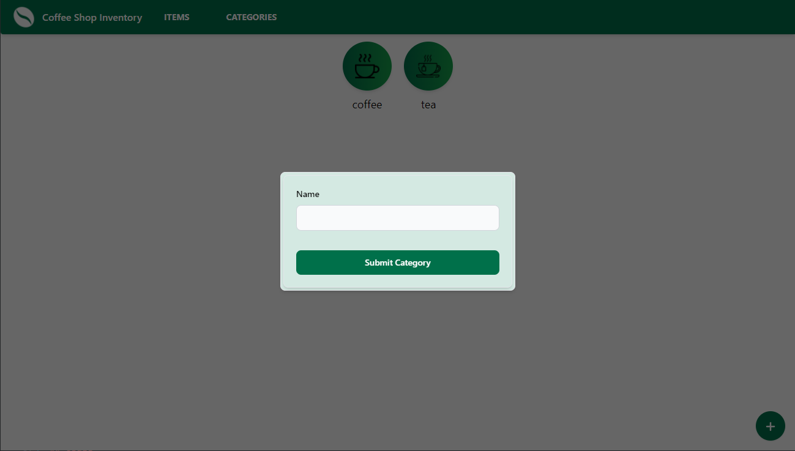
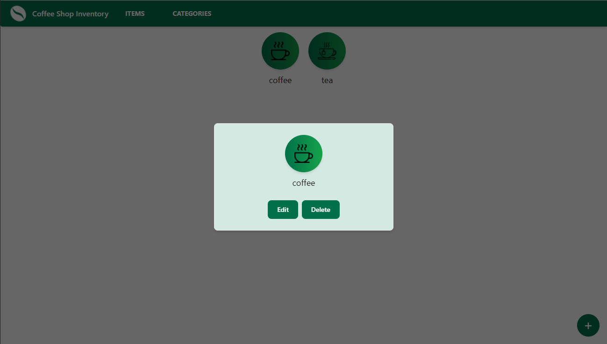

# coffee-shop-inventory-app

> Manage your shops inventory.

### ✨ [Demo](TODO: hostuj)

### 🛠 Tech Stack:
| Frontend      | Backend     |
| ------------- | ----------- |
| React         | NodeJS      |
| React-router  | ExpressJS   |
| TailwindCSS   | MongoDB     |
| Sass          | Axios       | 
| Axios         |         
| Framer-Motion |         
| Vite          |
| Figma         |

### 🚀 Features
- Create Read Update Delete functionality
- MVC architecture
- Sorting items by category
- Searching items by name
- React Modals (Portal)
- Framer Motion scrolling animation

### Screenshots:
<div>





</div>

### Install

```sh
npm install
```

### Usage

```sh
cd client && npm run dev
cd server && npm run dev
```

### Author 👋

 **Filip Ivanovic**

* Website: TODO: add portfolio
* Github: [@alkanoidev](https://github.com/alkanoidev)
